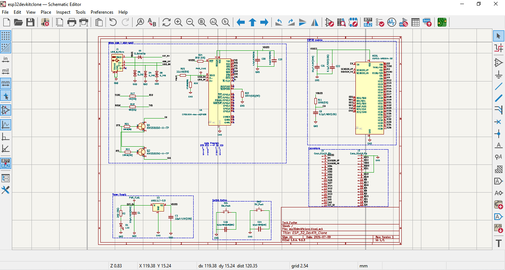
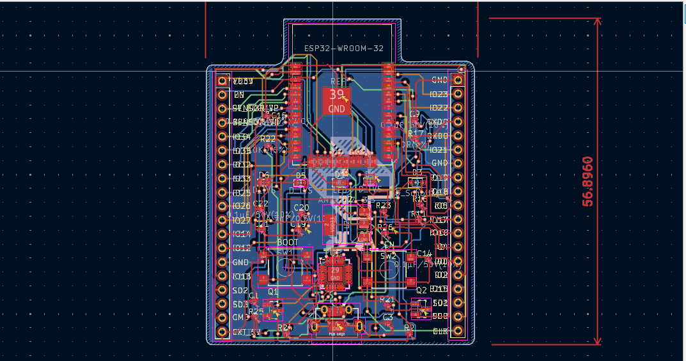
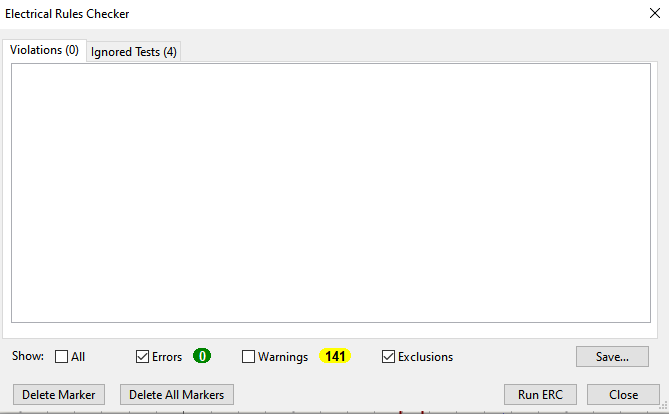
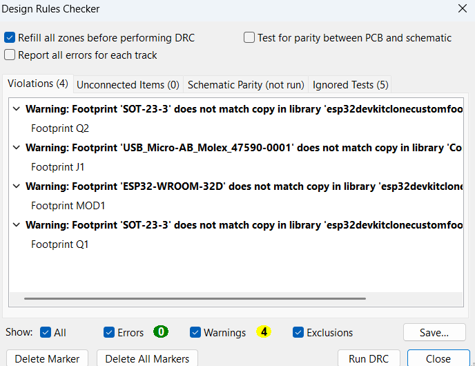
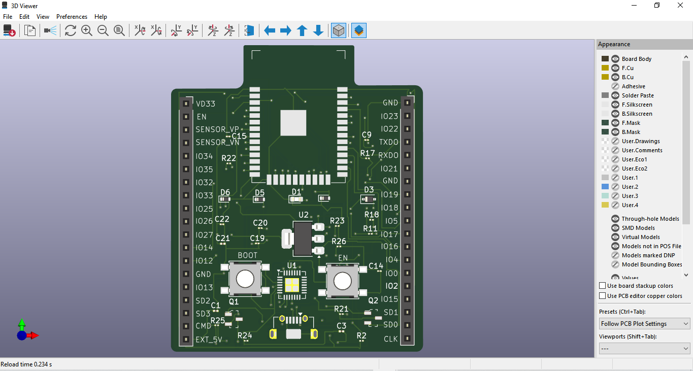
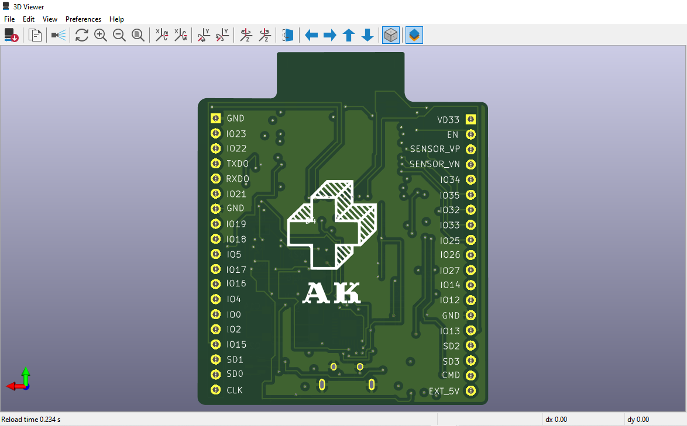
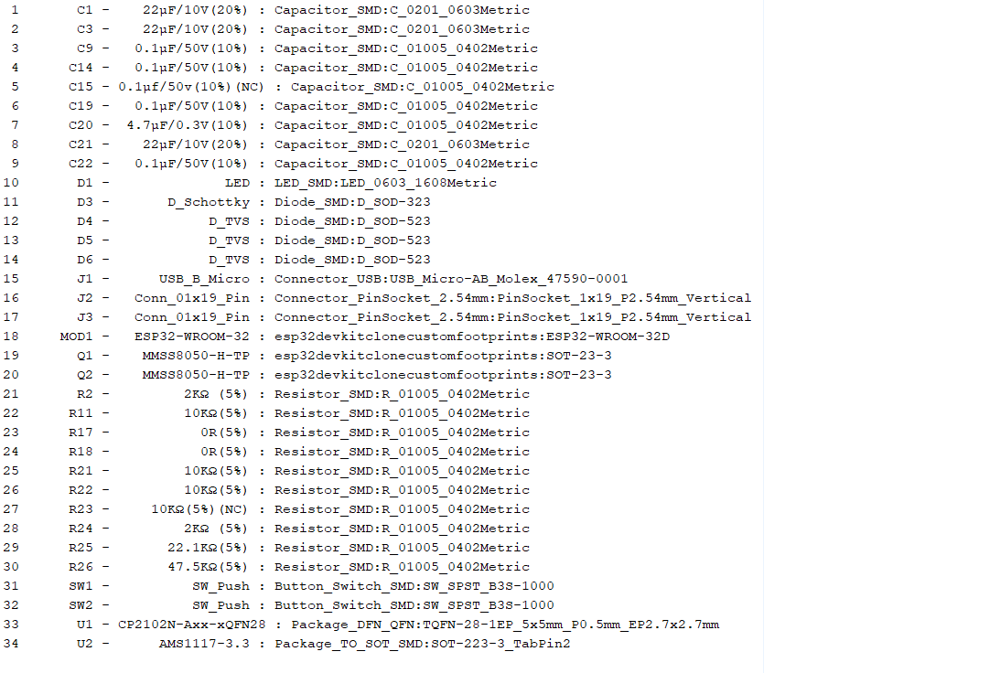
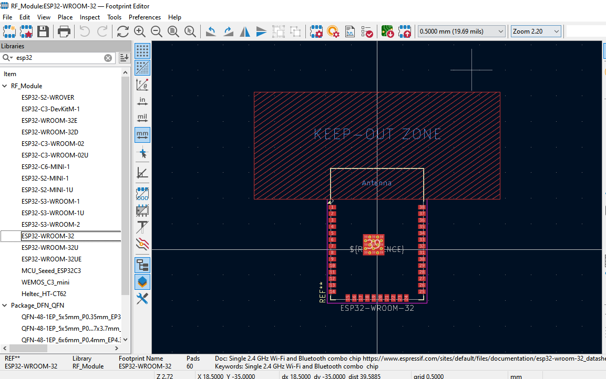

# 🛠️ ESP32 DevKit Clone – KiCad Project

This project is a custom PCB design of the **ESP32 DevKit**, created using  latest version of **KiCad 9.0.3**. The design is based on the official **ESP32-DevKitC-v4** reference schematic from Espressif, with modifications to suit custom layout preferences and component placement.Gerber files are attached.

---

## 📷 Project Images
# Schematic

# PCB Layout

# ERC

# DRC

# 3D top view

# 3D bottom view

# BOM

# FOOTPRINT VIEW

